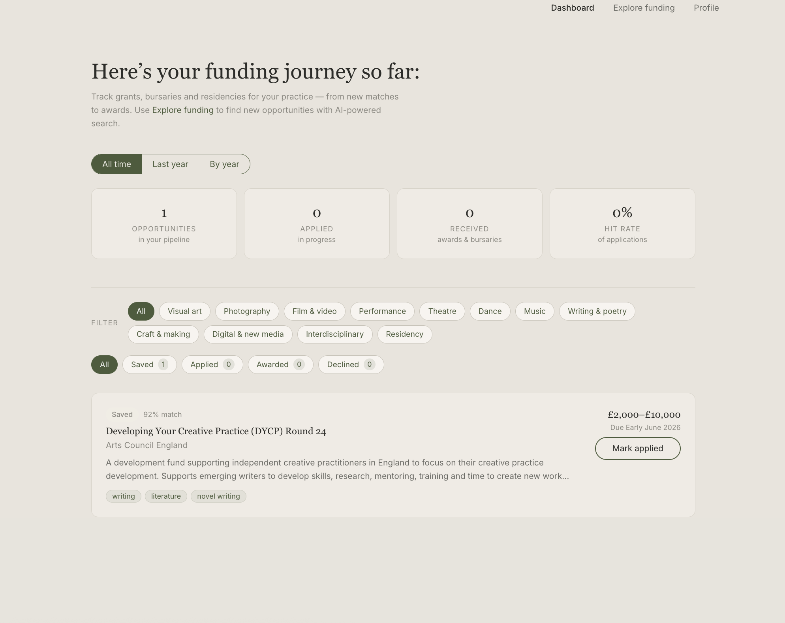
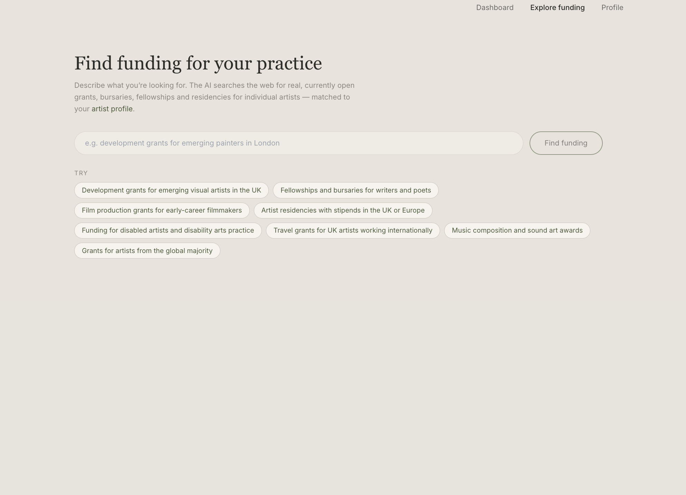
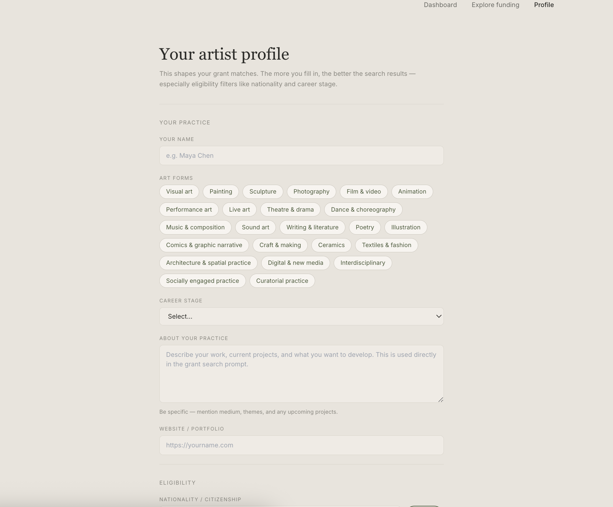

# GrantMatch

**AI-powered grant discovery for individual artists.**

---

GrantMatch helps independent artists find funding they're actually eligible for. Instead of spending hours trawling arts council websites, you describe what you're looking for in plain language — "development grants for emerging painters in London" — and the AI searches the web in real time, cross-references your profile (nationality, art form, career stage, practice), and returns a shortlist of currently open, high-confidence matches. Saved opportunities move into a personal pipeline where you can track applications from first contact through to award.

Built as a focused portfolio project during a transition into freelance development, with a deliberate emphasis on thoughtful product design, clean architecture, and real-world AI integration.

---

## Preview





---

## Tech Stack

| Layer | Technology |
|---|---|
| Framework | [Next.js 14](https://nextjs.org) (App Router) |
| Language | TypeScript |
| Styling | Tailwind CSS + custom CSS variables |
| Database | SQLite (local) / PostgreSQL (production) via [Prisma ORM](https://prisma.io) |
| AI | [Anthropic API](https://anthropic.com) — Claude with built-in web search |
| Deployment | [Vercel](https://vercel.com) |
| Font | Inter (body) + Playfair Display (headings) |

---

## Features

- **AI-powered search** — describe what you need in plain English; Claude searches the live web and returns real, currently open opportunities matched to your profile
- **Artist profile** — art forms, career stage, practice description, nationalities, country of residence, and optional demographics that inform grant eligibility
- **Strict eligibility filtering** — the AI cross-checks nationality, residency, and deadline before including any result; US-only grants are excluded unless explicitly open to international applicants
- **Grant pipeline** — track every opportunity from discovery through Saved → Applied → Awarded
- **Dashboard** — personal funding overview with stats (opportunities, applied, received, hit rate) based on your real pipeline
- **Clean, focused UX** — warm greige palette, serif headings, filter chips by art form and status; no clutter

---

## Local Development

### Prerequisites

- Node.js 18+ (the app uses `prisma generate` on install)
- An [Anthropic API key](https://console.anthropic.com/)

### 1. Clone and install

```bash
git clone https://github.com/your-username/grantmatch.git
cd grantmatch
npm install
```

### 2. Set up environment variables

```bash
cp .env.local.example .env.local
```

Open `.env.local` and fill in your values (see the table below).

### 3. Set up the database

```bash
npm run db:migrate
```

This creates `prisma/dev.db` (SQLite) and runs the initial migration. To inspect the database visually:

```bash
npm run db:studio
```

### 4. Run the development server

```bash
npm run dev
```

Open [http://localhost:3000](http://localhost:3000). The first thing you'll see is a prompt to complete your artist profile — do that, then head to **Explore funding** to run your first search.

---

## Environment Variables

| Variable | Required | Description |
|---|---|---|
| `DATABASE_URL` | Yes | Prisma database connection string. For local development: `file:./dev.db` (relative to `prisma/`). For production on Vercel, use a PostgreSQL connection string (e.g. from Vercel Postgres or Neon). |
| `ANTHROPIC_API_KEY` | Yes | Your Anthropic API key, available from [console.anthropic.com](https://console.anthropic.com/). Powers the grant search. |
| `ANTHROPIC_MODEL` | No | Override the Claude model used for search. Defaults to `claude-haiku-4-5-20251001`. You can set this to a more capable model (e.g. `claude-sonnet-4-6`) for higher quality results at higher cost. |

---

## Deploying to Vercel

### 1. Swap SQLite for PostgreSQL

SQLite is a local file — it won't work on Vercel's serverless infrastructure. Before deploying, update `prisma/schema.prisma`:

```prisma
datasource db {
  provider = "postgresql"
  url      = env("DATABASE_URL")
}
```

### 2. Create a PostgreSQL database

The simplest option is [Vercel Postgres](https://vercel.com/docs/storage/vercel-postgres) (available from the Storage tab in your Vercel project). Alternatives include [Neon](https://neon.tech) (generous free tier) or [Supabase](https://supabase.com).

### 3. Push the schema

```bash
npx prisma db push
```

Or, if you prefer migrations:

```bash
npx prisma migrate deploy
```

### 4. Deploy

```bash
# Install the Vercel CLI if you haven't already
npm i -g vercel

vercel
```

During setup, add these environment variables in the Vercel dashboard (or via `vercel env add`):

- `DATABASE_URL` — your PostgreSQL connection string
- `ANTHROPIC_API_KEY` — your Anthropic API key
- `ANTHROPIC_MODEL` — optional model override

Vercel automatically runs `npm install` on deploy, which triggers `prisma generate` via the `postinstall` script.

---

## What I Learned

This project was built from scratch during my transition into freelance development, and it pushed me across the full stack in ways a tutorial can't replicate.

**AI integration in production.** Working with the Anthropic API taught me that prompting is an engineering discipline. Getting the model to reliably return structured JSON — with accurate eligibility checks, correct deadlines, and no hallucinated organisations — required iterating on the system prompt the same way you'd iterate on code: adding constraints, running tests, observing failure modes, tightening rules. I also learned to handle real-world API behaviour like rate limits gracefully, with retry logic and user-facing feedback rather than silent failures.

**Database schema design under uncertainty.** I started with an organisation-focused schema and had to migrate it mid-build when the product direction shifted to individual artists. That experience — debugging a schema mismatch between Prisma's generated client and the live SQLite file — taught me more about how ORMs actually work than months of reading docs would have.

**Full-stack data flow.** Building every layer — the Prisma models, the Next.js API routes, the React state, the optimistic UI updates — in one codebase gave me a clear mental model of how data moves through a modern web application. I'm comfortable now reasoning about where state should live, when to fetch versus when to cache, and what happens when a request fails halfway through.

**Product thinking in code.** The explore/dashboard separation wasn't an architectural decision first — it was a product decision. Grants discovered by AI and grants the user has chosen to track are semantically different things, and conflating them made the app confusing. Translating that insight into a concrete change (filtering the dashboard fetch, updating the stats calculation, removing a filter chip) taught me how product clarity and code clarity reinforce each other.

---

## Future Features

- **Application notes** — rich text notes per grant, with deadline reminders
- **Email digests** — weekly summary of upcoming deadlines and suggested new searches
- **Grant sharing** — shareable links to individual grant cards for artist communities
- **Multiple profiles** — support for artists who maintain separate practices or identities
- **PostgreSQL full-text search** — faster filtering across large grant libraries
- **Deadline calendar** — visual timeline of application deadlines across the pipeline
- **CSV export** — download your grant pipeline for reporting or funding applications

---

## License

MIT — free to use, adapt, and build on.
